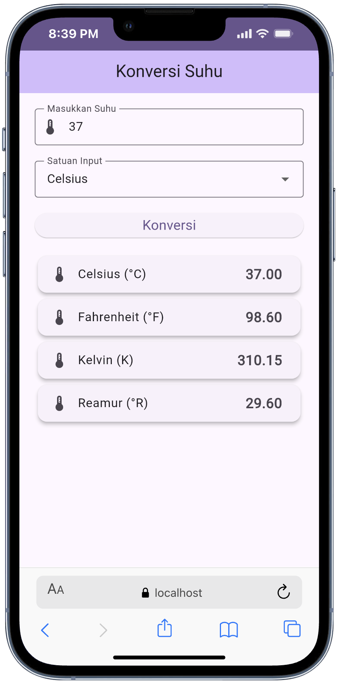
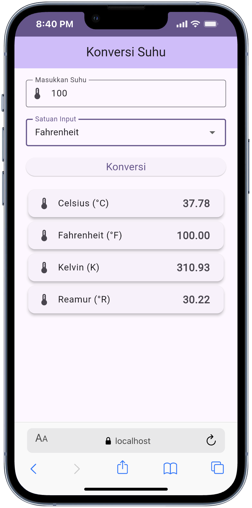
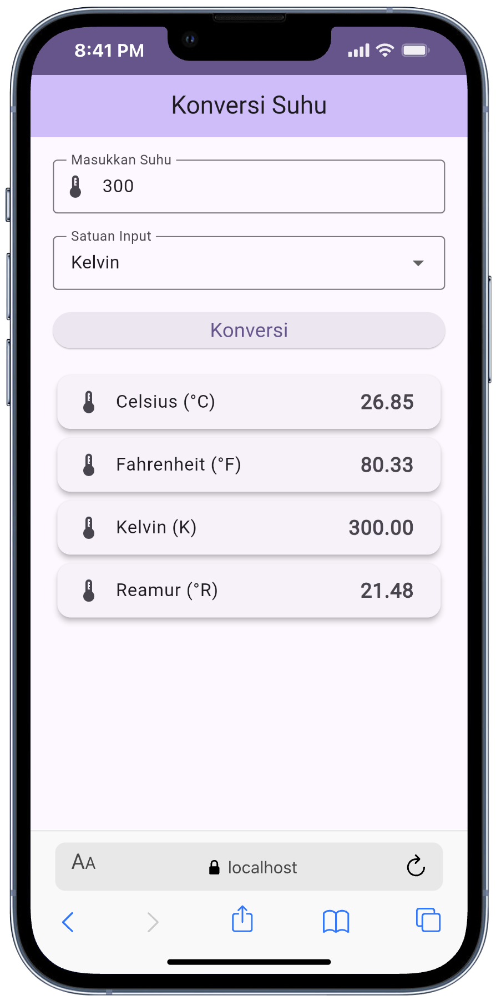

# Laporan Praktikum Konversi Suhu


## Fitur Utama

- Input suhu menggunakan `TextField`.
- Pemilihan satuan input dengan `DropdownButtonFormField`.
- Konversi ke Celsius, Fahrenheit, Kelvin, dan Reamur.
- Tampilan hasil dalam kartu terpisah agar mudah dibaca.

## Struktur Proyek

Struktur utama aplikasi:

```text
lib/
├── main.dart
├── models/
│   └── suhu_converter.dart
├── pages/
│   └── home_page.dart
└── widgets/
	└── hasil_card.dart
```

Keterangan:

- `main.dart`: entry point aplikasi dan konfigurasi tema.
- `models/suhu_converter.dart`: berisi enum satuan suhu, model hasil konversi, dan logika konversi.
- `pages/home_page.dart`: berisi tampilan utama dan pengelolaan input pengguna.
- `widgets/hasil_card.dart`: widget reusable untuk menampilkan hasil konversi.

## Konsep Modular yang Diterapkan

Refactor dilakukan agar kode lebih clean dan maintainable:

- Logika konversi dipindahkan ke file khusus agar mudah diuji.
- Widget hasil dibuat terpisah agar tidak ada pengulangan tampilan.
- Halaman utama hanya menangani alur input, aksi tombol, dan render UI.
- Penggunaan enum `SatuanSuhu` membuat kode lebih aman dibanding string literal di banyak tempat.

## Logika Kalkulator Konversi

Logika utama aplikasi berada pada file `models/suhu_converter.dart`. Proses konversi dilakukan dengan pendekatan satu titik acuan, yaitu Celsius.

Alurnya sebagai berikut:

1. Pengguna memasukkan sebuah nilai suhu.
2. Pengguna memilih satuan input: Celsius, Fahrenheit, Kelvin, atau Reamur.
3. Nilai input terlebih dahulu dikonversi ke Celsius.
4. Dari nilai Celsius tersebut, aplikasi menghitung seluruh hasil konversi ke satuan lain.
5. Hasil akhir ditampilkan dalam empat kartu hasil.

Pendekatan ini dipilih karena lebih sederhana dan mudah dirawat. Dibandingkan membuat rumus untuk setiap pasangan satuan, aplikasi cukup:

- mengubah semua input ke Celsius terlebih dahulu,
- lalu menghitung Celsius, Fahrenheit, Kelvin, dan Reamur dari satu nilai dasar yang sama.

Rumus yang digunakan:

- Fahrenheit ke Celsius: `(F - 32) * 5 / 9`
- Kelvin ke Celsius: `K - 273.15`
- Reamur ke Celsius: `R * 5 / 4`
- Celsius ke Fahrenheit: `(C * 9 / 5) + 32`
- Celsius ke Kelvin: `C + 273.15`
- Celsius ke Reamur: `C * 4 / 5`

Contoh alur:

- Jika pengguna memasukkan `100` dengan satuan `Celsius`, maka nilai dasar Celsius adalah `100`.
- Dari nilai tersebut, aplikasi menghitung:
- Fahrenheit = `212`
- Kelvin = `373.15`
- Reamur = `80`


## Cara Menjalankan Aplikasi

1. Pastikan Flutter SDK sudah terpasang.
2. Masuk ke folder proyek:

```bash
cd konversi_suhu
```

3. Jalankan aplikasi:

```bash
flutter run
```

## Hasil Pengujian

Pengujian dilakukan dengan dua tahap:

- `flutter analyze`
- `flutter test`

Status terakhir:

- `flutter analyze`: tidak ditemukan issue.
- `flutter test`: 9 test berhasil lulus.

Jenis pengujian yang digunakan:

- Unit test untuk memastikan rumus konversi suhu benar.
- Widget test untuk memastikan elemen UI tampil dan interaksi dasar berjalan.

## Hasil Tampilan Aplikasi

Berikut dokumentasi hasil aplikasi dari folder `screenshots`:

| Input Celsius | Input Fahrenheit |
| --- | --- |
|  |  |

| Input Kelvin | Input Reamur |
| --- | --- |
|  |  |

## Kesimpulan

Praktikum ini menghasilkan aplikasi konversi suhu yang sederhana namun sudah memiliki struktur kode yang lebih baik. Dengan pemisahan antara logika, halaman, dan widget, aplikasi menjadi lebih mudah dibaca, diuji, dan dikembangkan lebih lanjut.
